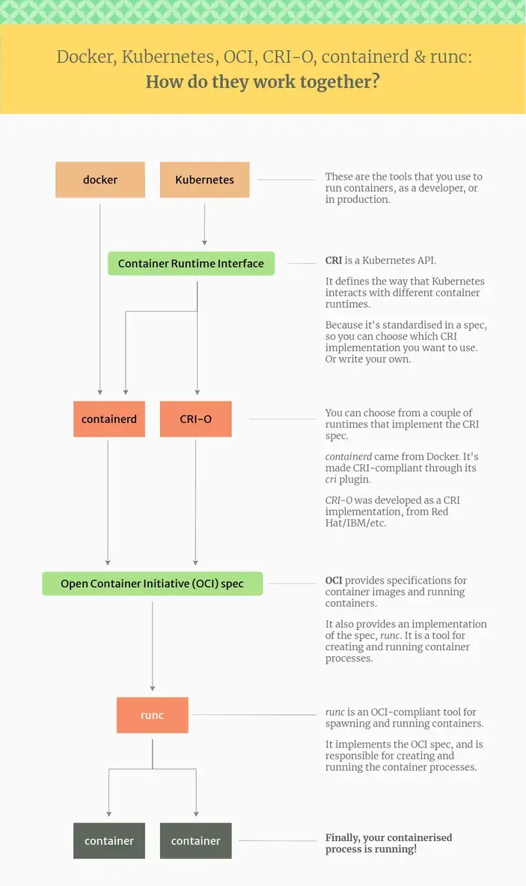

# Containers workshop 
* [A history lesson](#a-history-lesson)
* [Simple definitions](#simple-definitions)
    * [Namespaces and tags](#namespaces-and-tags)
* [What about VMs?](#what-about-vms)
* [Tools](#tools)
* [Compose](#compose)
    * [Quick check](#quick-check)
* [Exercises](#exercises)
    * [Task 1: Hello World](#task-1-hello-world)
    * [Task 2: Play around](#task-2-play-around)
    * [Task 3: Persist changes](#task-3-persist-changes)
    * [Task 4: Building a custom image with a Dockerfile](#task-4-building-a-custom-image-with-a-dockerfile)
    * [Task 5: JSON syntax, entrypoints and commands](#task-5-json-syntax-entrypoints-and-commands)
    * [Task 6: Multi-stage builds](#task-6-multi-stage-builds)
    * [Task 7: Dockerfile tips](#task-7-dockerfile-tips)
    * [Task 8: Inspect images](#task-8-inspect-images)
    * [Task 9: Compose files](#task-9-compose-files)
    * [Task 100: Do it yourself!](#task-100-do-it-yourself)
* [Task Extra: Multi-arch builds](#task-extra-multi-arch-builds)
* [A bit more theory now that we are experts!](#a-bit-more-theory-now-that-we-are-experts)
    * [ONBUILD](#onbuild)
    * [FROM SCRATCH &amp; not so scratch](#from-scratch--not-so-scratch)
    * [Docker security (API)](#docker-security-api)
    * [What are containers made of?](#what-are-containers-made-of)

## A history lesson
Docker, with a few others, established the Open Container Initiative (OCI) in June 2015. The OCI is an open governance structure for the express purpose of creating open industry standards around containers.
Docker donated the specs and the runtime environment [`runC`](https://github.com/opencontainers/runc) to the OCI.

The OCI currently contains three specifications: the Runtime Specification (runtime-spec), the Image Specification (image-spec) and the Distribution Specification (distribution-spec).
Images complying to these are called OCI Compliant Images, which we often call docker images, because it's shorter :D

## Simple definitions
- image: is immutable file system with a bit of metadata. Images are made of layers, conceptually stacked on top of each other. Images can share layers.
- container: you get one when you run an image with the runtime environment. It is an encapsulated set of processes running in a read-write copy of the image.
- docker, podman, rkt, lxc, cri-o, crun, firecracker-containerd, gVisor: container runtimes

It is important to note that container runtime on it lowest level nearly exclusively uses native linux primitives (e.g. 'docker volumes' are a kernel feature, namespacing/cgroups are responsible for isolation of containers, ...).


Source: https://www.tutorialworks.com/difference-docker-containerd-runc-crio-oci/

### Namespaces and tags
There are 3 namespaces used for naming images:
- root namespace for official images (e.g. busybox, alpine, ubuntu)
- user namespace for users and organizations (e.g. sskube/zverjasec)
- self-hosted namespace, which references the path to the image registry, and then suffixes it with one of the above (e.g. registry.example:5000/sskube/zverjasec)

Each image has a tag, which determines it's version or a variant. When users do not explicitly provide a tag, `latest` is used automatically.
Be carefull to always set an explicit tag for production environments!

## What about VMs?
VMs are more like full-on-computers - the OS is packed in and they use special drivers to talk to the hypervisor sitting on the bear metal.
Containers are run on top of the existing OS, basically on top of the kernel. They basically only contain the app with it's dependencies.

## Tools
Usually we talk about docker as a high-level orchestrator, but there are other tools achieving a similar goal! 
`Podman` has some nice advantages, most notably it can handle systemd inside containers and can easily run without root.
Since we are doing OCI compliant stuff, everything should work the same, no matter the tool.

Here are installation instructions for:
- [podman](https://podman.io/docs/installation) and
- [docker](https://docs.docker.com/engine/install/)
- but there is also the [online playground for docker](https://labs.play-with-docker.com/) if you prefer to use it for playing around

## Compose
Compose files (e.g. `docker-compose.yaml`) serve as a definition for running multiple containers together. Instead of writing all those run commands in the shell, compose helps us defining them as a simple configuration!

Installation:
- [podman compose](https://github.com/containers/podman-compose)
- [docker compose](https://docs.docker.com/compose/install/)

Examples: [List of docker compose scripts](https://github.com/docker/awesome-compose)

### Quick check

```bash
docker -v
Docker version 24.0.2, build cb74dfc
```
```bash
docker compose version
Docker Compose version v2.18.1
```
```bash
podman-compose version
podman-compose version: 1.0.6
['podman', '--version', '']
using podman version: 3.4.4
podman-compose version 1.0.6
podman --version 
podman version 3.4.4
exit code: 0
```

## Exercises

### Task 1: Hello World

In this task we will learn how to run a simple container!
We will use the `alpine` linux and run an echo command in it:
```bash
docker run alpine echo hello world!
```

First the alpine image with the latest `tag` is downloaded, if it is not yet present locally.
```bash
Resolved "alpine" as an alias (/etc/containers/registries.conf.d/shortnames.conf)
Trying to pull docker.io/library/alpine:latest...
Getting image source signatures
Copying blob 31e352740f53 done  
Copying config c1aabb73d2 done  
Writing manifest to image destination
Storing signatures
```

Then the image is run, and the `echo hello world!` command is executed inside the container.
```bash
hello world!
```

For the sake of completeness, let's run this with podman as well:
```bash
podman run alpine echo hello world!
Unable to find image 'alpine:latest' locally
latest: Pulling from library/alpine
31e352740f53: Pull complete 
Digest: sha256:82d1e9d7ed48a7523bdebc18cf6290bdb97b82302a8a9c27d4fe885949ea94d1
Status: Downloaded newer image for alpine:latest
hello world!
```

You can give it a go with other images as well, for example:
``` bash
docker run busybox echo hello world
```

### Task 2: Play around
Let's bring up a basic container, and then play around a little bit inside it!
```bash
docker run -it ubuntu
```
This brings up a brand new ubuntu container:
  - -i connects us to the container's stdin
  - -t tells the runtime to set up pseudo-terminal

Try to list number of packages in the container by issuint `dpkg -l | wc -l`, and now do it locally on your machine....fun, right?

If we didn't provide `-it`, the command would execute and then the container would exit, the same as in [Task 1](#task-1-hello-world).

If you make changes inside the container, `exit`, and then re-run it, the changes are lost, since we are running a base image (immutable).

> Your containers are still there, in a stopped state. List them using `podman ps -a`.

### Task 3: Persist changes
In order to persist changes in the docker container, we need to attach a volume to it. There are [many types available](https://docs.docker.com/storage/volumes/)!
```bash
docker run -it -v testvol:/test ubuntu
touch me.not.here
cd /test
touch aha.txt
exit
```
The magic happens with the `-v` flag, which defines a volume on the fly. A volume is similar to your normal mount. In this case we created a new named volume `testvol` and mounted it as `/test` inside the container. You can list available volumes like this:
```bash
docker volume ls
```
If we attach the same volume to our next container...the result is as expected! File we previously created is there. And the one we created outside of the mounted volume is gone.
```bash
docker run -v testvol:/test ubuntu ls /test
aha.txt
docker run -v testvol:/test ubuntu ls
```
Volumes can be shared between containers, can mount your local files so that the interactions in and out of the container are the same, you can even install drivers which do all sorts of magic (like automatic replication in a distributed filesystem).

### Task 4: Building a custom image with a Dockerfile
We will almost lways need custom images! In order to make building them repeatable and easy to automate, we use the `Dockerfile`! This is a set of instructions which tell us how to get FROM a certain image to what we need.

Inspect the [basic dockerfile](./task4/Dockerfile) for details!

Build and run your own image:
```bash
cd task4
docker build -t figlet .
docker image ls
docker run figlet figlet it works!
cd..
```
First the image is built and tagged with the `figlet` tag. This can help us find it later!

When the image is built, the cli we run is actually connecting (remotely) to the build deamon and sending the build context (`.` in our case) over! This makes it trivial to have build servers in a remote location.

From the output you will also see that there are multiple steps done, as described in the Dockerfile, and they are identified with a hash - this is the hash of an individual layer.

If you were to run build again, all the layers are taken from the cache, since the Dockerfile did not change, and all the layers are still the same.

### Task 5: JSON syntax, entrypoints and commands
In previous task we used the string syntax for the run command `RUN apt-get update`. It's JSON equivalent is `RUN ["apt-get", "install", "figlet"]`.
The difference is, that string commands are wrapped in `/bin/sh -c "..."`, while JSON commands are executed as-is.

Entrypoint is used to define a command which runs each time the container is started.

Command is used to define a default command to start the container with.

Inspect the [dockerfile](./task5/Dockerfile) for details!
```bash
cd task5
docker build -t task5 .
docker run task5
docker run task5 my own text
cd ..
```
Our entrypoint defined the style, and our command is only suffixed to it.
First run command will output the default we have defined in the Dockerfile (why is /bin/sh there?), while the second one will override it.

### Task 6: Multi-stage builds

```bash
cd task6
docker build -t task6 .
docker run task6
cd ..
```
- smaller image
- only what is needed to run the image - the only code that has no bugs is the one that doesn't exist!
- usefull pattern to have a development, build and production image. This way you always have your base, and then build on top of it, ensuring all the libraries and dependencies are the same - and they are, becaues you are re-using the same layers!

### Task 7: Dockerfile tips
Take the Dockerfile in task6 and improve it with the hintes below. See [this one](./task7/Dockerfile) for some hints!

This may be a standard structure of a Dockerfile:
```
# syntax=docker/dockerfile:1

LABEL "com.example.vendor"="ACME Incorporated"
LABEL com.example.label-with-value="foo"
LABEL version="1.0"
LABEL description="This text illustrates \
that label-values can span multiple lines."

FROM <baseimage>
RUN <install dependencies>
COPY <code>
RUN <build code>
RUN <install test dependencies>
COPY <test data sets and fixtures>
RUN <unit tests>
FROM <baseimage>
RUN <install dependencies>
COPY <vcode>
RUN <build code>
CMD, EXPOSE ...
```

- read [best practices](https://docs.docker.com/develop/develop-images/dockerfile_best-practices/)
- always set the `USER` in the Dockerfile, so that things are not run as root...
- each line in the docker file is a layer, with it's own hash. Each layer may be cached and/or re-used by other images
- one of the aproaches of building images is to include small unit tests or sanity checks just after build. Normal ones are still done in CI/DI pipelines.
- Wherever possible you most likely want to combine steps in order to reduce the size of the resulting image. Well, except if you want to cache each step... A nice example is combining RUN steps (e.g. apt installs)
- you may wish to copy dependencies inside the image, so that the dependency file hash (e.g. requirements.txt in python) gets recorded, and will be subsequently cached. This way you make sure dependencies are not re-installed all the time
- labels can help a great deal with image identification and automation, and can be queried using the `inspect` command


### Task 8: Inspect images
Build the image first:
```bash
docker build -t task8 task8
```
There's a bunch of info stored as metadata in individual images: `docker inspect task8`.
You may filter the output using your normal tools, e.g.:
```bash
docker inspect task8 | jq ".[0].Created"
docker inspect --format '{{ json .Created }}' task8
docker inspect task8 | grep Created
docker inspect task8 | python3 -m json.tool | grep Created | cut -d '"' -f4
```

> Try to find the labels we have previously set in the Dockerfile, and the architecture for which the image is built!

### Task 9: Compose files
Using compose files greatly simplifies our lives! Instead of typing all these build, run, mount, ... commands,
we instead create a declerative compose file with all the magic inside!

Let's just start it!
```bash
cd task9
docker compose up
```
Now visit [the running app](http://127.0.0.1:8000)!

Want to run the container in the background and see the logs?
```bash
CTRL+C
docker compose up -d
docker compose logs -f
```

Want to see what is running in this stack?
```bash
docker compose ps
```

What if we want to simply log in to the container and explore around?
```bash
docker compose exec www sh
ls
exit
```

Want to run another copy of the app?
```bash
PORT=8001 docker compose -p second_app up -d
curl localhost:8001
docker compose -p second_app down
```
Notice that apps are completely separate, with separate redis instances!

And now shut it down: 
```bash
docker compose down
cd ..
```

### Task 100: Do it yourself!
You need to create:
- a load balancer (e.g. nginx, caddy) shipping traffic to 4 backend services
- a backend service may be the same as in _task9_
- each backend service connects to the same database (redis)

Bonus:
- Be carefull to adhere to the best practices when writing compose/docker files!
- Do not expose ports and services which are not needed!
- Is there a way to build a production and a development image with the same baseline?
- Could development image support automatic code reload when sources are changed?

## Task Extra: Multi-arch builds
As you know, there are various processors running in our computers, and they are based on different architectures. Most popular lately is ARM. Since the architecture is different, software needs to be compiled for each arch as well!
We can build OCI images with support for multiple architectures.

Each image has a manifest containing important information about an image.
```bash
docker manifest inspect ubuntu
```
or, for more information
```bash
docker manifest inspect --verbose ubuntu
```

The manifest trick allows us to have different images for each arch, which the runtime automatically selects, under the same tag.

When building multi-arch images, docker will set a bunch of [arguments](https://docs.docker.com/engine/reference/builder/#automatic-platform-args-in-the-global-scope) (ARCH, TARGETPLATFORM,...). We can use them in our Dockerfile if needed, but it is not mandatory.

Let's build our image for 2 architectures using [buildx](https://github.com/docker/buildx#buildx):
```bash
docker buildx build --platform linux/arm64/v8,linux/amd64 --tag taskextra taskExtra
docker buildx build --load -t taskextra:latest taskExtra/
docker image inspect taskextra | grep 
docker buildx build --load --platform linux/arm64/v8 -t taskextra:latest taskExtra/
docker image inspect taskextra | grep Archi
```

The issue here is that the `--load` flag currently can not pull more than one platform. And by default, this is what we usually want, since pull will take care of selecting the correct platform from the manifest!

## A bit more theory now that we are experts!
Whenever you are building things with docker, [the reference manuals](https://docs.docker.com/reference/) are your best friends!

### ONBUILD
The ONBUILD instruction is a trigger. It sets instructions that will be executed when another image is built from the image being build.
This is useful for building images which will be used as a base to build other images.

`ONBUILD COPY . /src`

Caveats:
- You can't chain ONBUILD instructions with ONBUILD.
- ONBUILD can't be used to trigger FROM and MAINTAINER instructions.

### FROM SCRATCH & not so scratch
Until now we were using normal images as our basis for development. But, we said that images are not much more than a tar archive.
This means it can also be empty, and this is what scratch is - nothing!
Advantages:
- the image is really small
- there is realy nothing more than the application in there
- can be used really elegantly with languages which can compile statically, or if there's just a bunch of libraries needed

Disadvantages:
- never works well for development images
- it's hard to debug, since you don't have a shell, debuggers, ...
- user management doesn't work as expected!!
- no timezone info

Maybe a sweet spot here is google maintained [distroless images](https://github.com/GoogleContainerTools/distroless#distroless-container-images) and [chainguard maintained](https://github.com/chainguard-images) (mostly arch based). These are still without os tols (e.g. shell). The idea is to keep it as close as possible to scratch, but have some sane defaults baked in (e.g. folder structure, user files, timezones, ...)! So the images are not completely distroless :D

Example for go:
```Dockerfile
# Start by building the application.
FROM golang:1.18 as build

WORKDIR /go/src/app
COPY . .

RUN go mod download
RUN CGO_ENABLED=0 go build -o /go/bin/app

# Now copy it into our base image.
FROM gcr.io/distroless/static-debian11
COPY --from=build /go/bin/app /
CMD ["/app"]
```

Just to mention it quickly here, the `alpine` (and `alpaquita`) distributions are also intended as bases with small attack surface and small size. So pick wisely, test and read what each is about, inspect what images contain before blindly using them!

[Read this to de-hype a bit!](https://www.redhat.com/en/blog/why-distroless-containers-arent-security-solution-you-think-they-are)

### Docker security (API)
- Whoever has access to the Docker API will have FULL ROOT PRIVILEGES on the Docker host.
- If you start a container with `--privileged`, it will be able to access all devices and perform all operations. Add the `--net host` to the mix, and you can sniff all the traffic as well!
- you can also modify user accounts and their passwords, fiddle with certs and SSH auth, insert kernel modules, run processes and use kernel code to hide them,...

To mitigate this:
- do not expose API to the public!
- always secure it with a certificate
- let users interact with the API through a controlled environment (e.g. their own machine or CI/DI pipelines)
- run AppArmor or SELinux, to make the attacker lose 2 additional nerves

OCI Images should be scanned for vournabilities as well. There can be issues in the software or packages loaded, or with one of the runtimes used. A bunch of tools exist to help with vournability scanning, estimating image efficiency (e.g. dive), checking against security baselines like CIS Docker Benchmark (e.g. InSpec).
A large ecosystem of tools for SBOM generation, policy-defined rule checks, identity and network configuration are available.

Try to acces your local API: `curl --silent --unix-socket /var/run/docker.sock http://v1.41/version | python3 -m json.tool`

### What are containers made of?
[Original Source](https://faun.pub/kubernetes-story-linux-namespaces-and-cgroups-what-are-containers-made-from-d544ac9bd622)

Let's take docker and it's `containerd` runtime as an example. It sits on top of linux namespaces and cgroups.

__Containers__ 
are a technology that allows us to run the process in an independent environment with other processes on the same computer. So how does the container do that?
To do that, the container is built from a few new features of the Linux kernel, of which the two main features are “namespaces” and “cgroups”.

__Linux Namespaces__
are a feature of Linux that allows us to create something like a virtual machine, quite similar to the function of virtual machine tools. This main feature makes our process completely separate from the other processes.

Linux namespaces are a bunch of different kinds:
- The PID namespace allows us to create separate processes.
- The networking namespace allows us to run the program on any port without conflict with other processes running on the same computer.
- Mount namespace allows you to mount and unmount the filesystem without affecting the host filesystem.

__Cgroups__
We could have created a process separate from the other process with Linux namespaces. But if we create multiple namespaces, then how can we limit the resources of each namespace so that it doesn’t take up the resources of another namespace?

Luckily, in 2007 some people developed cgroups just for us. This is a Linux feature that allows you to limit the resources of a process. Cgroups will determine the limit of CPU and Memory that a process can use. 

__What is docker?__
Docker is just a tool to help us interact with the underlying container technology. To be more precise, Docker helps us easily create containers instead of having to do many things.

And to interact with the containers, Docker uses the container runtime - containerd.
